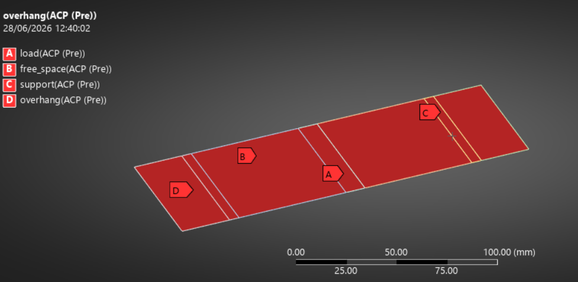
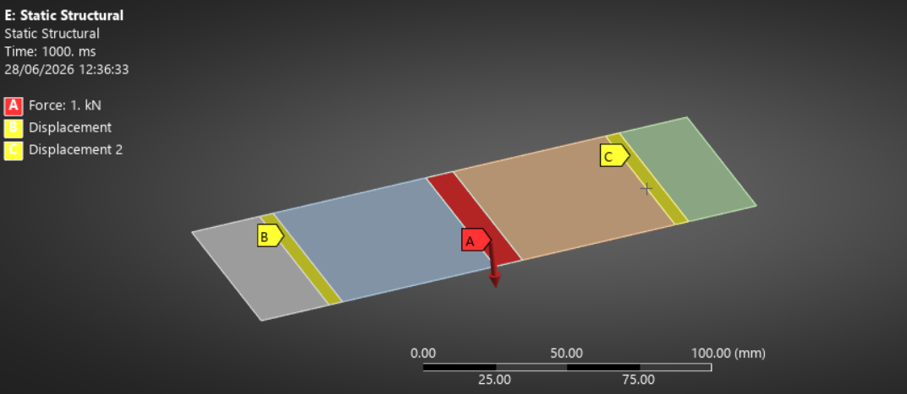
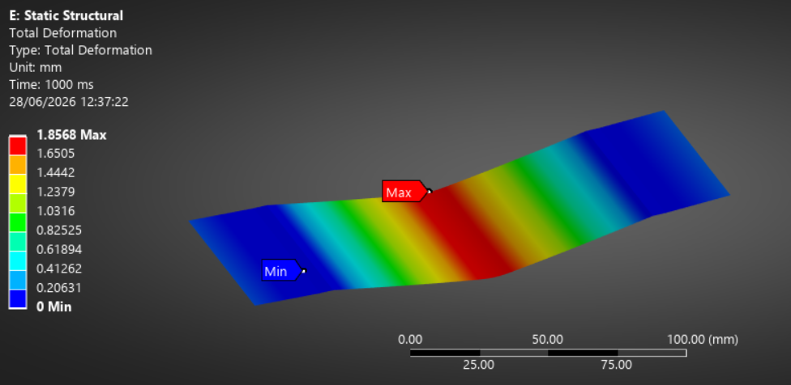
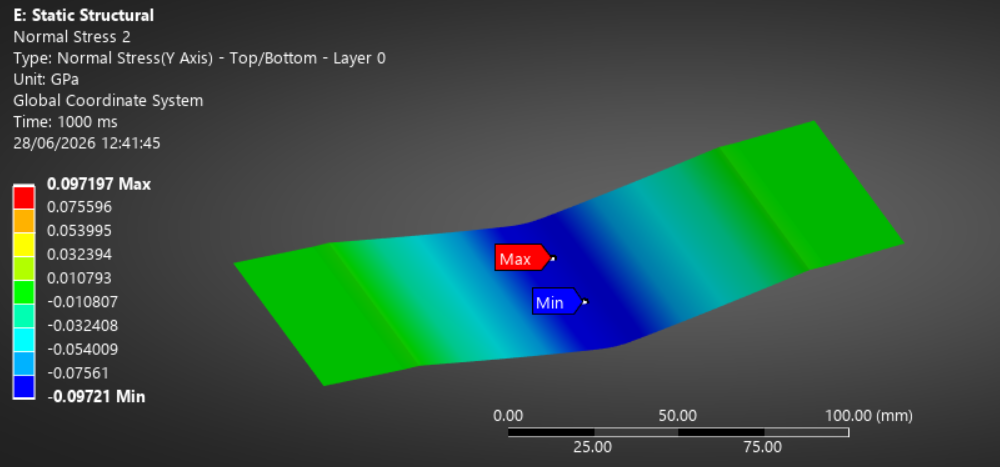
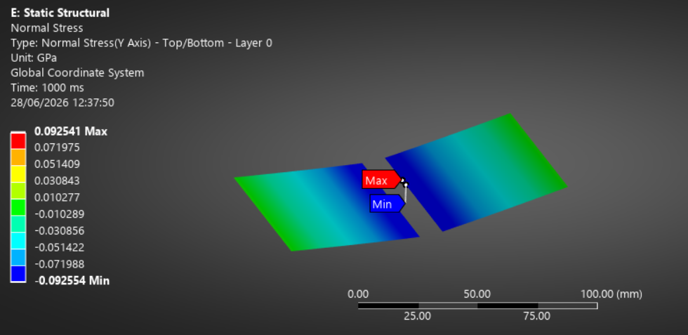
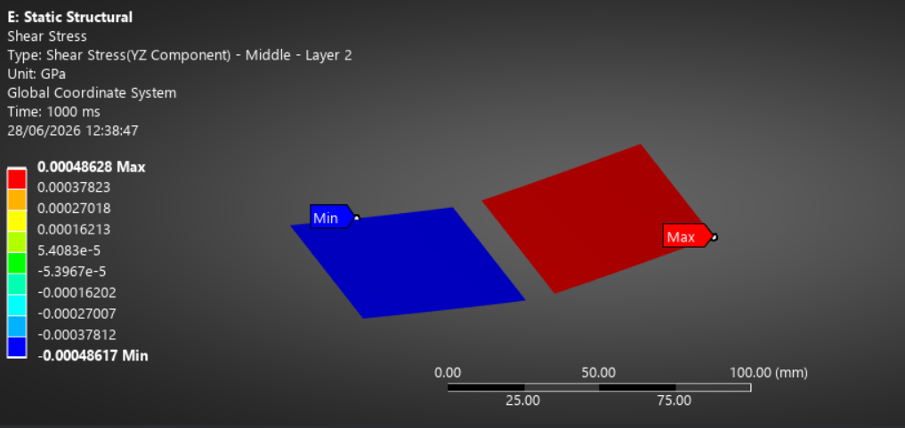
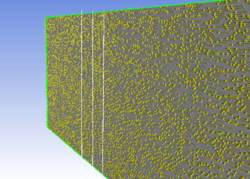

# Sandwich-Panel-Flexure-Validation-Study
HexPly® 8552/AS4 Plain Weave Skins + Rohacell® 51 IGF Core  Ansys ACP + Mechanical 3-Point Bend FEA per ASTM C393
--

## Overview

This repository documents an FEA validation study of a composite sandwich panel under three-point bending, modeled in Ansys Composite PrepPost (ACP) and Ansys Mechanical. Woven carbon/epoxy face sheets are bonded to a closed-cell PMI foam core. The study verifies the FEA model against analytical sandwich beam theory for face sheet bending stress, core shear stress, and mid-span deflection, and confirms all sandwich failure modes stay below allowables.

This is the sandwich extension of the [UD CFRP Tensile Coupon Validation](https://github.com/khizarsiddiqui2/UD-CFRP-Tensile-Coupon-Validation-Study) — same 8552 matrix, now in woven form with a foam core.

---

## Validation Results

| Check | FEA | Analytical | Difference | Status |
|---|---|---|---|---|
| Max face sheet stress (σyy) | ±92.5 MPa | — | — | ✅ |
| Max core shear stress (τyz) | 0.486 MPa | 0.654 MPa (peak) | ~25% | ✅ |
| Max mid-span deflection | 1.857 mm | 2.20 mm | ~16% | ✅ |

### Failure Mode Assessment (at 1,000 N)

| Failure Mode | FEA Stress | Allowable | IRF | Reserve | Status |
|---|---|---|---|---|---|
| Face sheet (max stress) | 92.5 MPa | 828 MPa | 0.112 | 8.9× | ✅ Pass |
| Core shear | 0.486 MPa | 0.8 MPa | 0.608 | 1.6× | ✅ Pass |
| Face sheet wrinkling | 92.5 MPa | ~180 MPa | 0.510 | 2.0× | ✅ Pass |

Core shear is the critical mode — expected for a low-density PMI core like Rohacell 51.

---

## Materials

### Face Sheet — HexPly 8552/AS4 Plain Weave (AGP193-PW)

| Property | Symbol | Value | Unit |
|---|---|---|---|
| Young's Modulus (warp) | E1 | 68,000 | MPa |
| Young's Modulus (fill) | E2 | 66,000 | MPa |
| Through-thickness Modulus | E3 | 9,000 | MPa |
| In-plane Shear Modulus | G12 | 5,000 | MPa |
| Out-of-plane Shear Modulus | G13 = G23 | 3,500 | MPa |
| Poisson's Ratio | ν12 | 0.05 | — |
| Tensile Strength (warp) | XT | 828 | MPa |
| Tensile Strength (fill) | YT | 793 | MPa |
| Cured Ply Thickness | CPT | 0.195 | mm |
| Density | ρ | 1,570 | kg/m³ |

### Core — Rohacell 51 IGF (PMI Foam, isotropic)

| Property | Value | Unit |
|---|---|---|
| Density | 52 | kg/m³ |
| Young's Modulus | 70 | MPa |
| Shear Modulus | 24 | MPa |
| Poisson's Ratio | 0.25 | — |
| Tensile Strength | 1.9 | MPa |
| Compressive Strength | 0.9 | MPa |
| Shear Strength | 0.8 | MPa |

---

## Coupon Geometry (ASTM C393)

| Parameter | Value |
|---|---|
| Total Length | 182.5 mm |
| Width | 75 mm |
| Support Span (c-c) | 125 mm |
| Overhang (each end) | 25 mm |
| Support Strip | 5 mm |
| Load Nose Strip | 10 mm |
| Core Thickness | 10 mm |
| Skin (2 plies each) | 0.39 mm |
| Total Thickness | 10.78 mm |
| Layup | [PW₂ / Core / PW₂] |



---

## Step-by-Step Procedure

### Step 1 — Define Materials (Engineering Data)
Create two new materials with Orthotropic Elasticity, Orthotropic Stress Limits, and Density:
- `HexPly_8552_AS4_PW` — woven skin (note E1 ≈ E2 because plain weave is balanced)
- `Rohacell_51_IGF` — foam core (E1 = E2 = E3, isotropic)

### Step 2 — Build Geometry (SolidWorks)
Model **7 separate surface bodies** side by side (not split lines on one surface — split lines don't transfer through Parasolid):
overhang / support / free span / load nose / free span / support / overhang. Export all as one Parasolid (.x_t).

### Step 3 — Import & Share Topology (SpaceClaim)
Import the Parasolid, apply **Share Topology** so the mesh is continuous across zone boundaries. Define named selections: `support` (×2), `load`, `free_space`, `overhang`.

### Step 4 — Layup (ACP Pre)
- Fabrics: `skin` (0.195 mm) and `core` (10 mm)
- Rosette: parallel, fiber along span axis
- Oriented selection set: all 7 surfaces
- Modeling plies: skin ×2 → core ×1 → skin ×2

### Step 5 — Transfer to Static Structural
Connect ACP Pre Setup → Static Structural Model (shell data).

### Step 6 — Mesh
SHELL181 layered elements, 3 mm element size.

### Step 7 — Boundary Conditions
- Left support: Displacement X = Y = Z = 0 (pin)
- Right support: Displacement Z = 0, X & Y free (roller)
- Load nose: Force 1,000 N in −Z

### Step 8 — Results
- Total Deformation (all bodies)
- Normal Stress Y — face sheet bending (Top/Bottom)
- Shear Stress YZ — **Layer 2, Position = Middle** for core shear (Top/Bottom shows zero!)

### Step 9 — Failure Assessment
Composite Failure Tool does not compute in Student edition — IRF computed manually from FEA stresses ÷ datasheet allowables.

### Step 10 — Validate
Compare against sandwich beam theory: core shear τ = F/(2bd), deflection δ = FL³/48D + FL/4AG.

---

## Results Images

### Boundary Conditions


### Total Deformation


### Face Sheet Bending Stress (full coupon)


### Face Sheet Bending Stress (free span)


### Core Shear Stress (Layer 2, mid-plane)


### ACP Layup


---

## Key Calculations

**Core shear stress:**
```
τ_core = F / (2 × b × d) = 1000 / (2 × 75 × 10.195) = 0.654 MPa
```

**Mid-span deflection:**
```
δ = FL³/48D + FL/4·A·G_core
  bending term ≈ 0.49 mm
  shear term   ≈ 1.71 mm
  total        ≈ 2.20 mm   (FEA: 1.857 mm)
```

**Failure indices:**
```
Face sheet:  IRF = 92.5 / 828  = 0.112  → RF 8.9×
Core shear:  IRF = 0.486 / 0.8 = 0.608  → RF 1.6×
Wrinkling:   IRF = 92.5 / 180  = 0.510  → RF 2.0×
```

---

## References

1. Hexcel Corporation. *HexPly® 8552 Epoxy Matrix Product Data Sheet* (woven reinforcements). 2023.
2. Evonik Operations GmbH. *ROHACELL® IG-F Product Information*. April 2022.
3. *ASTM C393/C393M: Standard Test Method for Core Shear Properties of Sandwich Constructions by Beam Flexure*.
4. Allen, H.G. *Analysis and Design of Structural Sandwich Panels*. Pergamon Press, 1969.
5. *CMH-17-6: Composite Materials Handbook, Volume 6. Structural Sandwich Composites*.

---

## Author

**Khizar Siddiqui** — Aerospace & Mechanical Engineer
[GitHub](https://github.com/khizarsiddiqui2)

> Related: [UD CFRP Tensile Validation](https://github.com/khizarsiddiqui2/UD-CFRP-Tensile-Coupon-Validation-Study) · [NACA0012 CFD Validation](https://github.com/khizarsiddiqui2/NACA0012-CFD-Validation)
